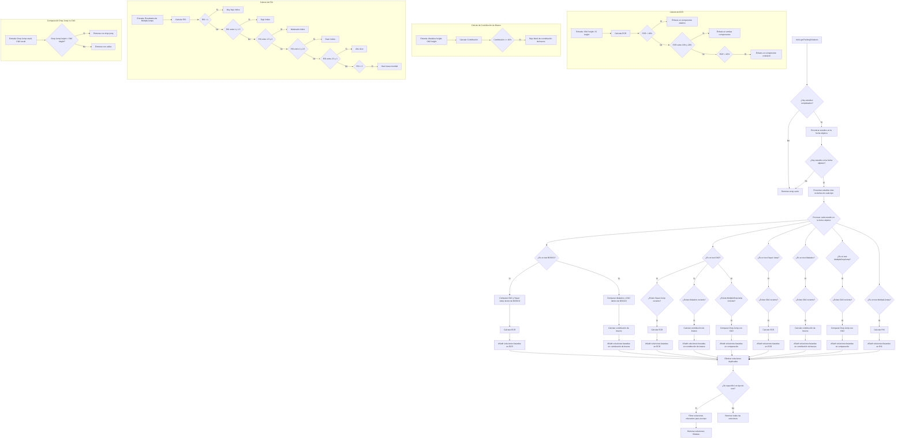

```mermaid
flowchart TD
    A[Inicio getTrainingSolutions] --> B{¿Hay estudios completados?}
    B -->|No| C[Retornar array vacío]
    B -->|Sí| D[Encontrar estudios en la fecha objetivo]
    D --> E{¿Hay estudios en la fecha objetivo?}
    E -->|No| C
    E -->|Sí| F[Encontrar estudios más recientes de cada tipo]

    F --> G{Procesar cada estudio en la fecha objetivo}

    G --> H{¿Es un test BOSCO?}
    H -->|Sí| I[Comparar CMJ y Squat Jump dentro de BOSCO]
    I --> J[Calcular ECR]
    J --> K[Añadir soluciones basadas en ECR]

    H -->|Sí| L[Comparar Abalakov y CMJ dentro de BOSCO]
    L --> M[Calcular contribución de brazos]
    M --> N[Añadir soluciones basadas en contribución de brazos]

    G --> O{¿Es un test CMJ?}
    O -->|Sí| P{¿Existe Squat Jump reciente?}
    P -->|Sí| Q[Calcular ECR]
    Q --> R[Añadir soluciones basadas en ECR]

    O -->|Sí| S{¿Existe Abalakov reciente?}
    S -->|Sí| T[Calcular contribución de brazos]
    T --> U[Añadir soluciones basadas en contribución de brazos]

    O -->|Sí| V{¿Existe MultipleDropJump reciente?}
    V -->|Sí| W[Comparar Drop Jump con CMJ]
    W --> X[Añadir soluciones basadas en comparación]

    G --> Y{¿Es un test Squat Jump?}
    Y -->|Sí| Z{¿Existe CMJ reciente?}
    Z -->|Sí| AA[Calcular ECR]
    AA --> AB[Añadir soluciones basadas en ECR]

    G --> AC{¿Es un test Abalakov?}
    AC -->|Sí| AD{¿Existe CMJ reciente?}
    AD -->|Sí| AE[Calcular contribución de brazos]
    AE --> AF[Añadir soluciones basadas en contribución de brazos]

    G --> AG{¿Es un test MultipleDropJump?}
    AG -->|Sí| AH{¿Existe CMJ reciente?}
    AH -->|Sí| AI[Comparar Drop Jump con CMJ]
    AI --> AJ[Añadir soluciones basadas en comparación]

    G --> AK{¿Es un test MultipleJumps?}
    AK -->|Sí| AL[Calcular RSI]
    AL --> AM[Añadir soluciones basadas en RSI]

    K --> AN[Eliminar soluciones duplicadas]
    N --> AN
    R --> AN
    U --> AN
    X --> AN
    AB --> AN
    AF --> AN
    AJ --> AN
    AM --> AN

    AN --> AO{¿Se especificó un tipo de test?}
    AO -->|Sí| AP[Filtrar soluciones relevantes para ese tipo]
    AO -->|No| AQ[Retornar todas las soluciones]
    AP --> AR[Retornar soluciones filtradas]

    subgraph "Cálculo de ECR"
        ECR1[Entrada: CMJ height, SJ height]
        ECR2[Calcular ECR]
        ECR3{ECR < 10%}
        ECR4{ECR entre 10% y 20%}
        ECR5{ECR > 20%}
        ECR6[Énfasis en componente elástico]
        ECR7[Énfasis en ambas componentes]
        ECR8[Énfasis en componente contráctil]

        ECR1 --> ECR2
        ECR2 --> ECR3
        ECR3 -->|Sí| ECR6
        ECR3 -->|No| ECR4
        ECR4 -->|Sí| ECR7
        ECR4 -->|No| ECR5
        ECR5 -->|Sí| ECR8
    end

    subgraph "Cálculo de Contribución de Brazos"
        ARM1[Entrada: Abalakov height, CMJ height]
        ARM2[Calcular Contribución]
        ARM3{Contribución <= 10%}
        ARM4[Bajo Nivel de coordinación de brazos]

        ARM1 --> ARM2
        ARM2 --> ARM3
        ARM3 -->|Sí| ARM4
    end

    subgraph "Cálculo de RSI"
        RSI1[Entrada: Resultados de MultipleJumps]
        RSI2[Calcular RSI]
        RSI3{RSI < 1}
        RSI4{RSI entre 1 y 1.5}
        RSI5{RSI entre 1.5 y 2}
        RSI6{RSI entre 2 y 2.5}
        RSI7{RSI entre 2.5 y 3}
        RSI8{RSI > 3}
        RSI9[Muy bajo índice]
        RSI10[Bajo índice]
        RSI11[Moderado índice]
        RSI12[Buen índice]
        RSI13[Alto nivel]
        RSI14[Nivel clase mundial]

        RSI1 --> RSI2
        RSI2 --> RSI3
        RSI3 -->|Sí| RSI9
        RSI3 -->|No| RSI4
        RSI4 -->|Sí| RSI10
        RSI4 -->|No| RSI5
        RSI5 -->|Sí| RSI11
        RSI5 -->|No| RSI6
        RSI6 -->|Sí| RSI12
        RSI6 -->|No| RSI7
        RSI7 -->|Sí| RSI13
        RSI7 -->|No| RSI8
        RSI8 -->|Sí| RSI14
    end

    subgraph "Comparación Drop Jump vs CMJ"
        DJ1[Entrada: Drop Jump result, CMJ result]
        DJ2{Drop Jump height > CMJ height?}
        DJ3[Entrenar con drop jump]
        DJ4[Entrenar con vallas]

        DJ1 --> DJ2
        DJ2 -->|Sí| DJ3
        DJ2 -->|No| DJ4
    end
```
